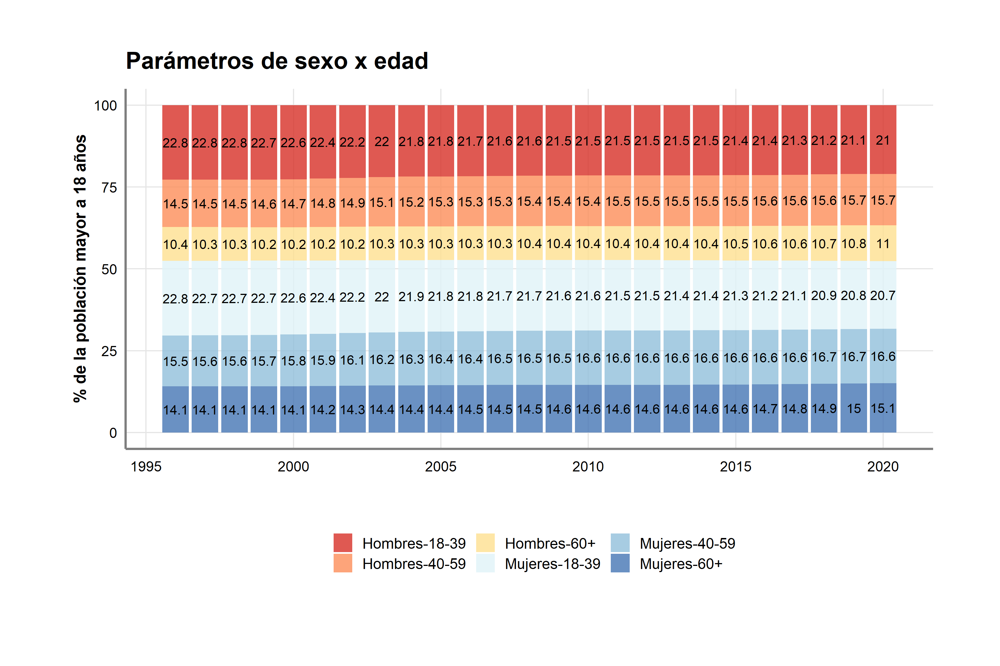

# parametros-op
### Parámetros para post-estratificación de encuestas de Opinión Pública en Uruguay (1993-2020)

- El script `parametros.R` genera la base `data_parametros.rda` que contiene parametros poblacionales de sexo x edad, nivel educativo, departamento y voto anterior. Los parámetros son para uruguayos de 18 años o más, residentes en Uruguay. En el caso de voto anterior los parámetros representan a las personas que efectivamente votaron en la elección anterior.

### Sexo x edad
- La fuente son las proyecciones poblacionales del INE (basadas en los censos de 1996, 2004 y 2011)
- 6 categorías: Hombres de 18 a 39; Mujeres de 18 a 39; Hombres de 40 a 59; Mujeres de 40 a 59; Hombres de 60 o más y Mujeres de 60 o más.

### Departamento
- La fuente son las proyecciones poblacionales del INE (basadas en los censos de 1996, 2004 y 2011)
- Las categorías son los 19 departamentos (la data original no estaba desagregada por edad, por lo que incluye menores de 18 años)

### Nivel educativo
- La fuente son las Encuestas Contínuas de Hogares (ECH) compatibilizadas por el IECON. 
- La variable utilizada es `bc_edu` (años de educación), recodificada en las siguientes categorías: Primaria o menos; Secundaria y Terciaria 

### Voto anterior
- La fuente es el paquete de R [Boreluy](https://nicolas-schmidt.github.io/Boreluy/)
- En cada elección se toman todos los partidos con al menos 5% de los votos recibidos, el resto se agrupan junto a los votos en blanco y nulos en la categoría residual (OP-BN)
